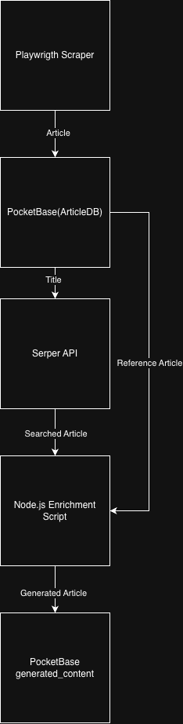

# BeyondChats Automation: AI Blog Enrichment

This project automates the process of scraping blog articles, enriching them with AI-generated insights, and presenting the "Original" vs "Enriched" versions in a modern React frontend.

## 🚀 Live Demo
https://beyondchats-automation.vercel.app/ (Vercel livendeployment)

---

## 🏗️ Architecture & Data Flow




**Components:**
1.  **PocketBase (Backend)**: Stores articles (`original_content`, `generated_content`) and handles admin auth.
2.  **Scraper (Phase 1)**: `scraper/phase1_scraper` - Fetches initial blog posts from `beyondchats.com`.
3.  **Generator (Phase 2)**: `scraper/phase2_generator` - Finds reference material via Serper.dev, uses Gemini 1.5 Flash to rewrite the article, and saves it back to DB.
4.  **Frontend (Phase 3)**: `frontend/` - React + Tailwind UI to browse and compare articles side-by-side.

---

## 🛠️ Local Setup Instructions

### Prerequisites
- Node.js (v18+)
- PocketBase executable (provided in `backend/` or download for your OS)

### 1. Setup Backend (PocketBase)
1.  Navigate to the backend directory:
    ```bash
    cd backend/pocketbase_...
    ```
2.  Start the server:
    ```bash
    ./pocketbase serve
    ```
3.  Open `http://127.0.0.1:8090/_/` and create an **Admin Account**.
4.  Create a collection named **`articles`** with these text fields:
    - `title`
    - `slug`
    - `original_content`
    - `generated_content`
    - `source_url`
    - `status` (Select option: "original", "enriched")

### 2. Configure Environment
Create a `.env.local` file in the **root** of the project:

```env
PB_ADMIN_EMAIL=your-admin-email@example.com
PB_ADMIN_PASSWORD=your-admin-password
GEMINI_API_KEY=your-gemini-api-key
SERPER_API_KEY=your-serper-api-key
```

### 3. Run the Scraper (Phase 1)
Fetch articles from the source blog:

```bash
cd scraper/phase1_scraper
npm install
node scrapeBeyondChats.js
```
*This will populate PocketBase with "original" articles.*

### 4. Run the Enrichment Agent (Phase 2)
Enhance articles with AI:

```bash
cd scraper/phase2_generator
npm install
node enrichArticles.js
```
*This scans for "original" articles, searches the web for references, and generating "enriched" versions.*

### 5. Run the Frontend (Phase 3)
Launch the UI to view results:

```bash
cd frontend
npm install
npm run dev
```
Open `http://localhost:5173` to see the application.

---